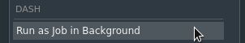

# dash

RStudio Addin to Run a Selection as a Background Job



RStudio daily release now includes a Jobs pane. See this excellent demo from @hrbrmstr for details.

<a href="http://www.youtube.com/watch?feature=player_embedded&v=EBlk1kRbKeU
" target="_blank"></a>

This allows one to source a script as a background job. But what about incidental code? This Addin allows one to highlight a region of code to be run as a background job.

## Installation

You can install the development version of `dash` from GitHub or GitLab

``` r
devtools::install_github("jonocarroll/dash")
devtools::install_gitlab("jonocarroll/dash")
```

## NOTES

* `dash` hastily pre-empts any official implementation, and as such will be rendered useless once that is complete.
* There doesn't appear to be an exported way to STOP a job, so keep an eye on your infinite loops.
* `dash` writes the selection as a temporary file and sources that, so the selected code must be valid.
